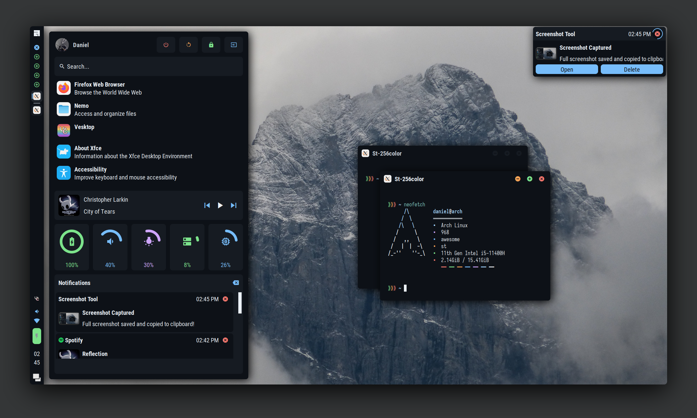

## AwesomeWM Config

#### Features
- Tab Switcher (Alt+Tab)
- Lock Screen (Shift+Alt+x)
- Sidebar/App Launcher (Super+p)

#### Requirements
- [Material Design Iconic Font](https://zavoloklom.github.io/material-design-iconic-font/)
- [Roboto Condensed Font](https://fonts.google.com/specimen/Roboto+Condensed)
- [Rubato](https://github.com/andOrlando/rubato) (Replace the Rubato folder)
- playerctl (Media)
- xbacklight (Brightness)
- NetworkManager (Wifi)
- pamixer & pactl (Audio)
- UPower (Battery)

#### Post-Installation
- Add your own background in `backgrounds/` and change in `themes.lua`
- Change `assets/pfp.jpg`
- Change `config.lua` based on your own system
- Change the pinned apps for the launcher in `components/sidebar/modules/launcher.lua`

#### Misc
- Theme is Github Dark, you can change it in `themes.lua`
